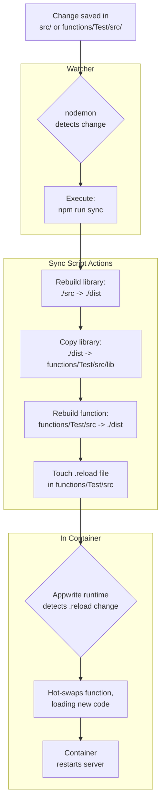
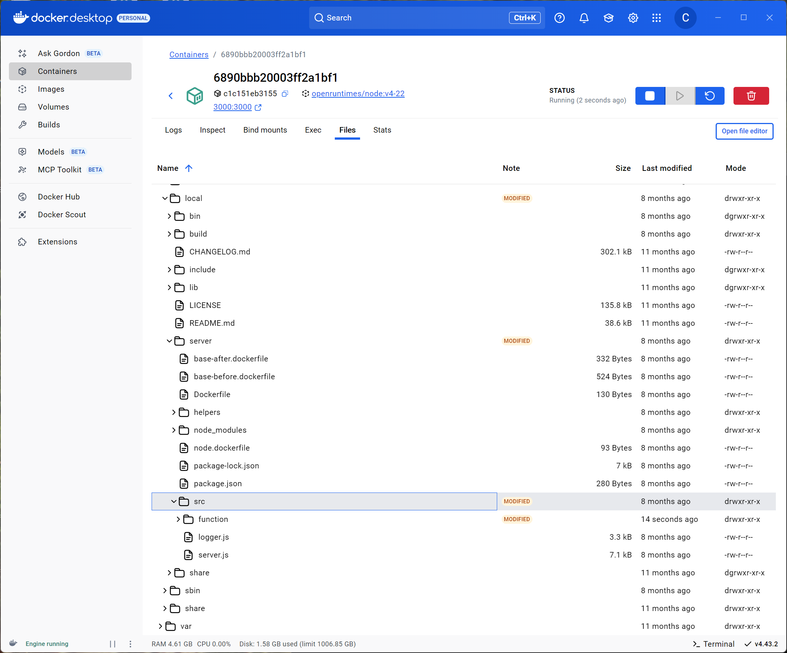

# Contributing

## Local Development Setup

This project is set up for a seamless local development experience, allowing you to make changes in both the core library (`./src`) and its associated Appwrite testing function (`./functions/Test`), with hot-reloading in the local Appwrite Docker container running the function.

### Prerequisites

- [Docker](https://www.docker.com/) is installed and running.
- The Appwrite CLI is installed globally: `npm install -g appwrite-cli@latest`.
- You are logged into your Appwrite account: `appwrite login`.

### Running the Test Function

The repository includes a test function in `./functions/Test/` that you can run against any Appwrite runtime (locally with Docker, self-hosted, or on Appwrite Cloud). It is meant to be used locally, though.

To run the function once for basic testing, use:

```sh
npm run test
```

This command simply starts the function container as defined by Appwrite, but doesn’t catch up with source code edits.

### Development with Hot-Reloading

For an interactive development workflow, the hot-reloading setup is the recommended approach. Start it with:

```sh
npm run dev
```

This command initiates a sophisticated, parallel process to handle live updates from both the core library and the test function.

#### How It Works

The development server relies on a cascading build and reload strategy orchestrated by `nodemon`.

**Workflow Diagram:**



{''}

**Explanation:**

1.  **Watch**: `nodemon` monitors the `./src` and `functions/Test/src` directories for any file changes.
2.  **Sync & Rebuild**: When a change is detected, `nodemon` executes the `npm run sync` script. This script performs a cascade of actions:
    - It first rebuilds the main library.
    - Then, it copies the compiled library code into the test function's `lib` directory.
    - Finally, it rebuilds the test function itself, ensuring all code is up-to-date.
3.  **Trigger Reload**: After the rebuilds are complete, the script uses the `touch` command to update a special `.reload` file inside the function's source directory.
4.  **Appwrite Hot-Swap**: The running Appwrite container detects the modification to the `.reload` file and triggers its internal hot-swapping mechanism. It reloads the function, loading the newly compiled code from the `functions/Test/dist` directory.

This setup ensures that any change, whether in the shared library or the function-specific code, is automatically and correctly reflected in the running test environment.

### Advanced Debugging

Sometimes you may need to debug the Appwrite runtime itself.

With the Docker Desktop GUI, it’s quite easy browsing the server files:



Without a GUI, you can get a shell inside the container:

```sh
docker exec -it <container_id> sh
```

From there, you can find the relevant files:

1. The runtime server code is at `/usr/local/server/src/server.js`.
2. The user function code is at `/usr/local/server/src/function/`.

You can live-edit `server.js` to add debugging logs. Simply save the file and hit **Restart** in the Docker Desktop GUI, or run `docker container restart <container_id>`.
