# Getting Started

The _Appwrite Function Router_ library (AFR for short) offers a simple yet powerful way to handle incoming HTTP requests in your Appwrite functions, routing them to handlers—so-called _route handlers_, also known as _endpoints_ or sometimes _middlewares_. Let's clarify:

- A _route handler_ is a working function associated with an _endpoint_; the endpoint declares which HTTP request(s) it is interested in, but delegates the actual work to its route handler, which must build and return an HTTP response.
- A _middleware_ is a special kind of _route handler_ that simply returns nothing, but can produce side effects (e.g., modifying the incoming request, preparing the outgoing response, logging, connecting to third-party services to send/fetch data, etc.), before letting the request continue to the next middleware (if any) or the final endpoint.

You can create processing chains by chaining _middlewares_ up to an _endpoint_, which will necessarily be the terminus.

Both _route handlers_ and _middlewares_ can `throw` an error to immediately stop the request processing, which will automatically and immediately return an error response.

Here's what they look like in practice:

<!-- prettier-ignore-start -->
```typescript
import { handleRequest } from '@kaibun/appwrite-fn-router';

// 0. This is your usual Appwrite function.
export default async (context) => {

  // 1. AFR essentially requires you to call a single function: handleRequest.
  //    Be sure to return its return value, i.e., the HTTP response.
  return handleRequest(

    // 2. You must pass it the Appwrite context, otherwise it won't work.
    context,

    // 3. Then, as a convenience, it creates a router for you and exposes it
    //    in a callback you provide, where you can register routes
    //    (endpoint/handler pairs)!
    (router) => {
      // router.get('/hello') is an endpoint that will intercept and handle
      // HTTP requests of type GET /hello, delegating the processing to its
      // route handler, i.e., the callback (here anonymous, but you can define
      // it elsewhere, import it, etc.)
      router.get('/hello', (req, res) => res.text(`Hello ${req.foo}!`));
    },

    // 4. Optionally, you can pass options (more on this just after).
    {
      log: false,
      errorLog: true,
      ittyOptions: {
        before: [
          // This callback is a before-middleware, so executed *before*
          // the route handler of the endpoint that matched a request (and for
          // any request; middlewares are not selective by default, unless their
          // logic is—e.g., only react if req.method === "POST", etc.).
          (req, res, log, error) => {
            req.foo = 'bar'; // This data will be available in the endpoint.
            log('I’m a middleware! I tweaked the request. Have fun, bye.');
          },
        ],
      },
    }
  );
};
```
<!-- prettier-ignore-end -->

## Link between AFR and itty-router

As a utility library, AFR is essentially a smart _wrapper_ around a micro-router, [itty-router](https://itty.dev/itty-router/api#router). AFR manages the instantiation and integration of an itty `Router` within the Appwrite Functions runtime, which is a bit non-standard compared to the usual JavaScript/Node world, so not immediately compatible with routers designed for Node. AFR ensures that all incoming/outgoing data flows smoothly, and also handles TypeScript typing, CORS options, etc.

I recommend reading the itty documentation, because by design, AFR re-exposes almost the entire itty API. So you only need to learn one tool; and itty can be used outside of Appwrite functions too!

For example, the `handleRequest` method of AFR transparently accepts all options supported by itty, such as `catch`, `before`, `finally`, `routes`, etc. Just send them in the `ittyOptions` property of the options object:

```typescript
import { handleRequest } from '@kaibun/appwrite-fn-router';

export default async (context) => {
  return handleRequest(context, () => {}, {
    ittyOptions: {
      // For example, itty also accepts lower-level route declarations,
      // but it's less convenient than AFR's callback!
      routes: [
        ['GET', /^\/hello$/, [(req, res) => res.text('Hello!')], '/hello'],
      ],
      // itty also accepts, among other options, a callback to handle exceptions.
      catch: (err, req, res, log, error) => {
        error('Oops, caught an error:', err);
        return res.json(
          { message: 'Something (whatever) went really wrong.' },
          500
        );
      },
    },
  });
};
```

:::info
**How itty-router works, in summary:**

TODO: summarize
:::

## Handler and Middleware Signatures

An Appwrite function receives from its runtime environment a `context` object, which contains four properties:

- `req` is an `AppwriteRequest` object (a custom type for Appwrite, not the standard Web API `Request`)
- `res` is an `AppwriteResponse` object (a custom type for Appwrite, not the standard Web API `Response`)
- `log` is a function to log normal messages, visible in the Appwrite web console
- `error` is a function to log error messages (also visible in the console)

:::info
For TypeScript fans, the corresponding types are `AppwriteRequest`, `AppwriteResponse`, `DefaultLogger`, and `ErrorLogger`.
:::

This Appwrite context is passed as-is to AFR, as the first argument to `handleRequest`, so that AFR can understand which request it should react to, how to respond, etc.

Unfortunately but logically, the itty router is not designed to work with these specific Appwrite object formats. In fact, no Node router is. Fortunately, AFR takes care of everything, by adapting the context.

**All _route handlers_ and _middlewares_ will automatically receive an enhanced context, the "AFR context", this time as a list of arguments, always in this order:**

1. The `AppwriteRequest` (with some tweaks to work well with itty-router)
2. The `AppwriteResponse`, as received by the Appwrite function
3. The `log` function, as above
4. The `error` function, as above
5. An object, often called `internals`, which notably contains a native `Request` (but you normally won't need it)
6. Optionally, anything else you want to pass along the request processing chain!

#### Example of a _route handler_ using its AFR context:

```typescript
router.get('/widgets', (req, res, log, error) => {
  log(`Handling ${req.method} ${req.path} like a boss.`);
  error('No widgets found, though.');
  return res.json({ items: [] });
});
```

#### Example of a _middleware_ doing something silly:

```typescript
router.all('*', (req, res, log, error, internals) => {
  log('I’m definitely not returning a response. But...');
  log("'AM GONNA LEAK SOME DATA BRO! RAAAAGGGIIN");
  log(internals.request.headers['authorization']);
});
```

## Logical Flow, Step by Step

The following diagram illustrates how the library manages all this. The parts you interact with are highlighted (_Your Appwrite function_).

```mermaid
flowchart TD
    SG1:::styleSG1

    subgraph SG1["Your Appwrite function 🏄"]
        direction LR
        B("handleRequest");
        D["Define route handlers returning AppwriteResponseObject"];
    end

    subgraph "In the library ✨"
        direction LR
        B_to_C["AppwriteRequest → Request"];
        Z["CORS, etc."];
        C{Itty Router};
    end

    A[AppwriteRequest] --> B;
    B --> B_to_C;
    B_to_C --> C;
    B_to_C --> Z;
    Z --> C;
    D --> C;
    C --> F[AppwriteResponseObject];

    style B fill:#783988,stroke:#fff,stroke-width:2px,color:#fff
    style D fill:#783988,stroke:#fff,stroke-width:2px,color:#fff
    classDef styleSG1 fill:none,margin-bottom:50px
```



### 1. Receive the Appwrite request with [`handleRequest(context, withRouter)`](/usage/handleRequest)

This is the main entry point. It takes the Appwrite execution `context` and your callback (internally called `withRouter`).

```typescript
import { handleRequest } from '@kaibun/appwrite-fn-router';

// This is your typical Appwrite function handler, with
// its context containing req, res, log, and error objects.
export default async (context) => {
  return handleRequest(context, (router) => {
    // You will define your routes here at step 3
  });
};
```

:::info
Internally: it duplicates the `req` object from the context, in `AppwriteRequest` format, into a standard `Request` object, which the itty router can then understand and manipulate.
:::

### 2. Get a new router from [`createRouter`](/usage/createRouter)

This function creates a new itty router instance. You will register your routes on this instance at the next step.

:::info
Internally: the creation of the `Router` is automatically handled by `handleRequest`, so you don't need to call this function yourself.
:::

### 3. Define Routes with `withRouter`

In the `withRouter` callback of `handleRequest`, you define your routes.

Each route handler will receive the AFR context, i.e., a `req` object, followed by `res`, `log`, `error`, and finally `internals` (if you need it, which you shouldn't). If all goes well, it returns an object in the `AppwriteResponseObject` format, and `res` has methods to generate these. The signature of your handlers should typically be:

```typescript
handleRequest(context, (router) => {
  router.get('/', (req, res, log, error) => {
    return res.send('Hello, world!');
  });

  router.post('/users', async (req, res, log, error) => {
    const user = await req.bodyJson;
    // E.g., validate and save the user...
    // ... and maybe get a modified user (with an ID)? Return it!
    return res.json({ success: true, user });
  });
});
```

:::info
Internally: again, AFR ensures the Appwrite context is transposed into an "AFR context" that looks almost identical, but is also compatible with the itty router.
:::

### 4. Wait for `runRouter` to find the right endpoint

After defining your routes, `handleRequest` internally calls [`runRouter`](/usage/runRouter).

When an HTTP request arrives, this function searches among the declared routes for a match; if it finds one, it executes its _handler_, otherwise, a 404 error response is returned. This happens automatically, so you just have to wait for requests from your users!

:::info
Internally: it's the `router.fetch` method that is triggered, and it needs to work with a native `Request`. Fortunately, AFR has prepared this in `internals.request`. But again, this is a detail you don't need to worry about.
:::

### 5. Let your `AppwriteResponseObject` go

As you saw in step 3, a _route handler_ must return an `AppwriteResponseObject`, which is the response format expected by the Appwrite runtime (instead of a standard Node `Response`). We also saw that you can generate such an object using the `res` utilities (`res.json()`, `res.send()`, etc.). But you can also simply compose an object matching the following shape:

```typescript
type ResponseObject<BodyType = unknown> = {
  body: BodyType;
  statusCode: number;
  headers: Headers;
};
```

AFR ensures that such an object is correctly returned by the function. Finally, the Appwrite Functions runtime will convert it into a standard `Response` to actually send the HTTP response over the network.

```typescript
// The most important part of your work: define route handlers
// returning well-formed AppwriteResponseObject (it's super easy!)
//
// Here's a slightly more realistic example, showing you can use async code.
router.get('/posts/:id', async (req, res, log, error) => {
  const { id } = req.params;
  const post = await db.posts.findById(id);

  if (!post) {
    error(`Post not found: ${id}`);
    reportError({ category: 'post', req: req.toString(), params });
    return res.status(404).send('Article not found');
  }

  return res.json(post);
});
```

### 3. Define Routes thanks to `withRouter`

Inside `handleRequest`’s `withRouter` callback, you define your routes.

Each route handler now receives a single merged `req` object (combining the native `Request` and Appwrite's `req`), followed by `res`, `log`, and `error`. This means your handler signature should be:

```typescript
handleRequest(context, (router) => {
  router.get('/', (req, res, log, error) => {
    // req is the merged request (Request & AppwriteRequest)
    return res.send('Hello, World!');
  });

  router.post('/users', async (req, res, log, error) => {
    const user = await req.bodyJson;
    // Do something with the user... maybe await some result...
    return res.json({ success: true, user });
  });
});
```

### 4. Wait for `runRouter` to work its magic

After defining your routes, `handleRequest` internally calls [`runRouter`](/usage/runRouter). This function matches the incoming native `Request` against the defined routes and executes the corresponding handler (if any; otherwise an error response is returned). This happens automatically, so there's nothing for you to do.

### 5. Say farewell to `AppwriteResponseObject`

As you’ve seen on step 3, a route handler must return a standard `AppwriteResponseObject`. One may generate such an object using the `res` helper methods (`.json()`, `.send()`, etc.), or simply compose an object satisfying the following shape:

```ts
type ResponseObject<BodyType = unknown> = {
  body: BodyType;
  statusCode: number;
  headers: Headers;
};
```

The library ensures such an object is correctly returned by the function, without any further transformation needed on your part. Eventually, Appwrite Functions’ runtime will take care of converting it to a vanilla `Response` to actually send the HTTP response onto the network.

```typescript
// The most important part of your job: defining route handlers
// returning AppwriteResponseObject (easy peasy!)
router.get('/posts/:id', async (vanillaRequest, req, res, log, error) => {
  const { id } = req.params;
  const post = await db.posts.findById(id);

  if (!post) {
    return res.status(404).send('Post not found');
  }

  return res.json(post);
});
```
