# How it works

The library provides a simple yet powerful way to handle requests in your Appwrite functions by routing them to specific handlers.

Its main goal is to abstract away the **native** Web `Request` and `Response` objects that routers typically use. This allows you, the developer, to work exclusively with Appwrite's familiar `req` and `res` objects, providing a seamless development experience within the Appwrite ecosystem.

## Logical Flow

The following diagram illustrates how the library handles this transformation. The parts you interact with are highlighted (_User Land_).

```mermaid
graph TD
    subgraph "User Land 🏄"
        direction LR
        B("handleRequest");
        D["Define route handlers returning AppwriteResponseObject"];
    end

    subgraph "Library Internals ✨"
        direction LR
        B_to_C["AppwriteRequest → VanillaRequest"];
        C{Itty’s Router};
    end

    A[AppwriteRequest] --> B;
    B --> B_to_C;
    B_to_C --> C;
    D --> C;
    C --> F[AppwriteResponseObject];

    style B fill:#783988,stroke:#fff,stroke-width:2px,color:#fff
    style D fill:#783988,stroke:#fff,stroke-width:2px,color:#fff
```



### 1. Welcome Appwrite’s request with `handleRequest`

This is the main entry point. It takes the Appwrite execution `context` and your `withRouter` callback.
Internally, it transforms the Appwrite-specific request object into a vanilla `Request` object that the internal router can understand and manipulate.

```typescript
// src/main.ts
import { handleRequest } from '@kaibun/appwrite-fn-router';

// This is your typical Appwrite function handler, with
// its context holding the req, res, log and error objects.
export default async (context) => {
  return handleRequest(context, (router) => {
    // You will define your routes here in step 3
  });
};
```

### 2. Get a fresh router from `createRouter`

This function creates a new router instance. You will register your routes on this instance in the next step. Creating the router is done internally by `handleRequest`, so you don't need to call it yourself.

### 3. Define Routes thanks to `withRouter`

Inside `handleRequest`’s `withRouter` callback, you define your routes. The handler for each route receives both the vanilla `Request` and Appwrite’s `req` objects, as well as the rest of Appwrite’s context (`res`, `log` and `error`), so you can keep workingg in a familiar environment.

```typescript
// ... let’s implement the withRouter callback, registering our routes:
handleRequest(context, (router) => {
  router.get('/', (vanillaRequest, req, res, log, error) => {
    // req and res are Appwrite's abstractions
    // Using res methods, the route handler must return
    // AppwriteResponseObject which are expected by the runtime
    return res.send('Hello, World!');
  });

  router.post('/users', async (vanillaRequest, req, res, log, error) => {
    const user = req.body;
    // Do something with the user... maybe await some result...
    return res.json({ success: true, user });
  });
});
```

### 4. Wait for `runRouter` to work its magic

After defining your routes, `handleRequest` internally calls `runRouter`. This function matches the incoming native `Request` against the defined routes and executes the corresponding handler (if any; otherwise an error response is returned). This happens automatically, so there's nothing for you to do.

### 5. Say farewell to `AppwriteResponseObject`

As you’ve seen on step 3, a route handler must return a standard `AppwriteResponseObject`. One may generate such an object using the `res` helper methods (`.json()`, `.send()`, etc.), or simply compose an object satisfying the following shape:

```ts
type ResponseObject<BodyType = unknown> = {
  body: BodyType;
  statusCode: number;
  headers: Headers;
};
```

The library ensures such an object is correctly returned by the function, without any further transformation needed on your part. Eventually, Appwrite Functions’ runtime will take care of converting it to a vanilla `Response` to actually send the response onto the network.

```typescript
// The most important part of your job: defining route handlers
// returning AppwriteResponseObject (easy peasy!)
router.get('/posts/:id', async (vanillaRequest, req, res, log, error) => {
  const { id } = req.params;
  const post = await db.posts.findById(id);

  if (!post) {
    return res.status(404).send('Post not found');
  }

  return res.json(post);
});
```
