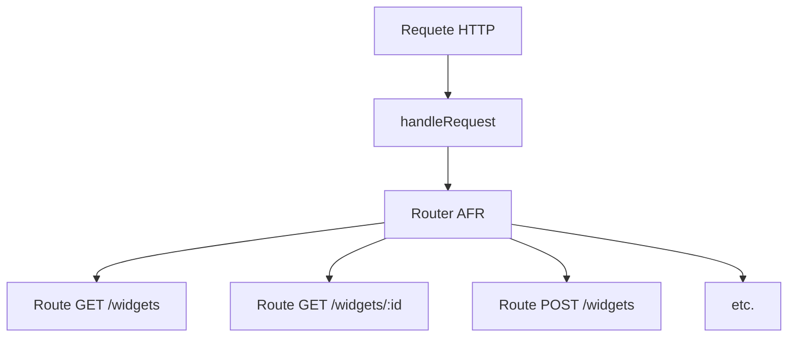

import TriggerFunction from '@site/src/components/TriggerFunction';
import { TRIGGER_API_BASE_URL } from '@site/src/components/trigger-function-config';
import TriggerFunctionAdvanced from '@site/src/components/TriggerFunctionAdvanced';

# Créer une API REST Appwrite avec AFR, étape par étape

Ce guide vous accompagne pas à pas pour créer une API REST pour la ressource fictive `Widget` avec la librairie **Appwrite Function Router (AFR)**. Il s’adresse aux débutants ou à toute personne découvrant les fonctions Appwrite.

:::note Pourquoi créer sa propre API REST avec AFR ?
Appwrite expose déjà une [API REST native pour accéder à ses collections](https://appwrite.io/docs/apis/rest). Cependant, développer votre propre API REST présente de nombreux avantages :

- **Logique métier personnalisée** : ajoutez des traitements avant/après lecture/écriture (validation, enrichissement, calculs, etc.).
- **Validation avancée** : contrôlez finement les données entrantes/sortantes, gérez des cas métier complexes.
- **Sécurité renforcée** : appliquez vos propres règles d’authentification, d’autorisation, de filtrage, etc.
- **Intégration avec des outils tiers** : connectez facilement d’autres services (API externes, analytics, emails, etc.) dans vos endpoints.
- **API sur-mesure et réutilisable** : exposez uniquement les routes et les formats utiles à vos clients (front, mobile, partenaires…) ; masquez la structure interne Appwrite, ce qui découple votre API de Appwrite.
- **Interopérabilité** : adaptez les conventions de votre API (RESTful, GraphQL, RPC…) à vos besoins ou à ceux de vos utilisateurs.
- **Versionning et documentation** : maîtrisez le cycle de vie, la documentation et l’évolution de votre API indépendamment du backend Appwrite.

En résumé, construire une surcouche, par exemple ici de type API REST, vous permet de transformer Appwrite en un véritable backend programmable, adapté à vos besoins métier et à vos standards d’API.
:::

## 1. Installer la librairie

```bash
npm install @kaibun/appwrite-fn-router
```

## 2. Créer le routeur principal

Créez un fichier `src/main.ts` dans votre fonction Appwrite :

```typescript
import { handleRequest } from '@kaibun/appwrite-fn-router';

export default async function main(context) {
  return await handleRequest(context, (router) => {
    // You’ll add routes here
  });
}
```

:::info

Ce tutorial part du principe que vous utilisez TypeScript, mais AFR fonctionne aussi avec JavaScript: utilisez des fichiers .js, et si vous croisez des types TypeScript, supprimez les dans votre code.

:::

## 3. Ajouter une route GET pour lister les widgets

```typescript
import { handleRequest } from '@kaibun/appwrite-fn-router';

export default async function main(context) {
  return await handleRequest(context, (router) => {
    // highlight-start
    router.get('/widgets', (_req, res) => {
      return res.json({
        items: [
          { id: 'widget1', weight: 10, color: 'red' },
          { id: 'widget2', weight: 20, color: 'blue' },
        ],
      });
    });
    // highlight-end
  });
}
```

<TriggerFunction method="GET" url={`${TRIGGER_API_BASE_URL}/widgets`} label="Tester la requête" />

## 4. Ajouter une route POST pour créer un widget

```typescript
router.post('/widgets', async (req, res) => {
  const body = req.bodyJson;
  if (typeof body.weight !== 'number' || !body.color) {
    return res.json(
      {
        code: 'VALIDATION_ERROR',
        message: 'Missing required fields',
        errors: ['weight and color are required'],
      },
      400
    );
  }
  const newWidget = {
    id: `widget-${Date.now()}`,
    weight: body.weight,
    color: body.color,
  };
  return res.json(newWidget, 201);
});
```

<TriggerFunction
method="POST"
url={`${TRIGGER_API_BASE_URL}/widgets`}
body={{ weight: 42, color: 'red' }}
label="Créer un widget"
/> 

## 5. Ajouter une route GET pour récupérer un widget par ID

```typescript
router.get('/widgets/:id', (req, res) => {
  const { id } = req.params;
  if (id === 'not-found') {
    return res.json({ code: 'NOT_FOUND', message: 'Widget not found' }, 404);
  }
  return res.json({ id, weight: 10, color: 'red' });
});
```

<TriggerFunction method="GET" url={`${TRIGGER_API_BASE_URL}/widgets/widget1`} label="Voir widget1" />

<TriggerFunctionAdvanced
  method="GET"
  url={`${TRIGGER_API_BASE_URL}/widgets/:id`}
  label="Tester avec paramètre dynamique et Auth (avancé)"
  urlParams={["id"]}
/>

## 6. Ajouter une route PATCH pour modifier un widget

```typescript
router.patch('/widgets/:id', async (req, res) => {
  const { id } = req.params;
  const body = req.bodyJson;
  const updatedWidget = {
    id,
    weight: body.weight ?? 10,
    color: body.color ?? 'red',
  };
  return res.json(updatedWidget);
});
```

<TriggerFunction
  method="PATCH"
  url={`${TRIGGER_API_BASE_URL}/widgets/widget1`}
  body={{ weight: 15, color: 'blue' }}
  label="Mettre à jour widget1"
/> 

<TriggerFunctionAdvanced
  method="PATCH"
  url={`${TRIGGER_API_BASE_URL}/widgets/:id`}
  label="PATCH avancé : body éditable, Auth, param dynamique"
  urlParams={["id"]}
  body={{ weight: 15, color: 'blue' }}
/>

## 7. Ajouter une route DELETE pour supprimer un widget

```typescript
router.delete('/widgets/:id', (req, res) => {
  const { id } = req.params;
  if (id === 'not-found') {
    return res.json({ code: 'NOT_FOUND', message: 'Widget not found' }, 404);
  }
  return res.send('', 204);
});
```

<TriggerFunction method="DELETE" url={`${TRIGGER_API_BASE_URL}/widgets/widget1`} label="Supprimer widget1" />

## 8. Schéma global du routage



## 9. Aller plus loin

Consultez la [documentation complète](https://github.com/kaibun/appwrite-fn-router) pour découvrir toutes les options (middlewares, gestion d’erreur, etc.).
Inspirez-vous du code source réel dans `functions/Test/src/routes/widgets.ts` pour des exemples avancés.

---

## Pour aller plus loin

- **Ajouter des middlewares** : authentification, logging, CORS, etc. (voir la doc AFR)
- **Gérer les erreurs globalement** : personnalisez le handler d’erreur pour unifier les réponses d’erreur de votre API
- **Déployer sur Appwrite Cloud** : testez votre fonction en production, gérez les variables d’environnement, etc.
- **Générer une documentation OpenAPI** : décrivez vos routes avec TypeSpec et exposez une doc interactive (ex : Scalar)
- **Tester vos routes automatiquement** : utilisez Vitest, Jest ou un outil HTTP pour écrire des tests d’intégration
- **Composer plusieurs routeurs** : structurez votre API en modules (ex : `/widgets`, `/users`, etc.)
- **Ajouter des hooks de pré/post-traitement** : pour la validation, la transformation de données, l’audit, etc.
- **Supporter d’autres formats** : exposez aussi du GraphQL, du Webhook, etc. en plus du REST
- **Internationaliser vos messages d’erreur** : retournez des messages adaptés à la langue du client
- **Limiter le débit (rate limiting)** : protégez votre API contre les abus

<scalar-callout type="info" title="Astuce">
Vous pouvez adapter ce guide pour n’importe quelle ressource (User, Article, etc.) en changeant simplement les routes et le modèle de données.
</scalar-callout>
