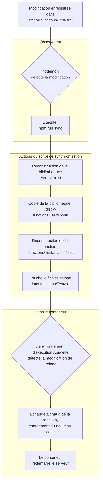

# Setup pour dev en local

## Configuration du Développement Local

Ce projet est configuré pour une expérience de développement local transparente, vous permettant d'apporter des modifications à la fois à la bibliothèque principale (`./src`) et à sa fonction de test Appwrite associée (`./functions/Test`), avec rechargement à chaud dans le conteneur Docker Appwrite local exécutant la fonction.

### Prérequis

- [Docker](https://www.docker.com/) est installé et en cours d'exécution.
- L'Appwrite CLI est installée globalement : `npm install -g appwrite-cli@latest`.
- Vous êtes connecté à votre compte Appwrite : `appwrite login`.

### Exécution de la Fonction de Test

Le dépôt inclut des tests, de différentes nature :

- des tests d’intégration (Cypress e2e), qui mobilisent notamment `./functions/Test/` que vous pouvez exécuter sur n'importe quel environnement d'exécution Appwrite (localement avec Docker, auto-hébergé ou sur Appwrite Cloud). Elle est cependant destinée à être utilisée localement ;
- des tests unitaires (Vitest).

Pour exécuter les deux à la fois en parallèle :

```sh
npm run test
# sinon :
# npm run test:e2e
# npm run test:unit
```

Cette commande démarre simplement le conteneur de la fonction tel que défini par Appwrite, mais ne prend pas en compte les modifications du code source.

### Développement avec rechargement à chaud

Pour un flux de travail de développement interactif, la configuration de rechargement à chaud est l'approche recommandée. Démarrez-la avec :

```sh
npm run dev
```

Cette commande lance un processus parallèle sophistiqué pour gérer les mises à jour en direct de la bibliothèque principale et de la fonction de test.

#### Comment ça marche

Le serveur de développement repose sur une stratégie de construction et de rechargement en cascade orchestrée par `nodemon`.

**Diagramme du flux de travail :**



{''}

**Explication :**

1.  **Observer** : `nodemon` surveille les répertoires `./src` et `functions/Test/src` pour toute modification de fichier.
2.  **Synchroniser & Reconstruire** : Lorsqu'une modification est détectée, `nodemon` exécute le script `npm run sync`. Ce script effectue une cascade d'actions :
    - Il reconstruit d'abord la bibliothèque principale.
    - Ensuite, il copie le code de la bibliothèque compilée dans le répertoire `lib` de la fonction de test.
    - Enfin, il reconstruit la fonction de test elle-même, s'assurant que tout le code est à jour.
3.  **Déclencher le Rechargement** : Une fois les reconstructions terminées, le script utilise la commande `touch` pour mettre à jour un fichier spécial `.reload` dans le répertoire source de la fonction.
4.  **Échange à Chaud Appwrite** : Le conteneur Appwrite en cours d'exécution détecte la modification du fichier `.reload` et déclenche son mécanisme interne d'échange à chaud. Il recharge la fonction, chargeant le code nouvellement compilé depuis le répertoire `functions/Test/dist`.

Cette configuration garantit que toute modification, que ce soit dans la bibliothèque partagée ou dans le code spécifique à la fonction, est automatiquement et correctement répercutée dans l'environnement de test en cours d'exécution.

### Débogage Avancé

Parfois, vous pourriez avoir besoin de déboguer l'environnement d'exécution Appwrite lui-même.

Avec l'interface graphique de Docker Desktop, il est assez facile de parcourir les fichiers du serveur :


Sans interface graphique, vous pouvez obtenir un shell à l'intérieur du conteneur :

```sh
docker exec -it <container_id> sh
```

De là, vous pouvez trouver les fichiers pertinents :

1. Le code du serveur d'exécution se trouve à `/usr/local/server/src/server.js`.
2. Le code de la fonction utilisateur se trouve à `/usr/local/server/src/function/`.

You can live-edit `server.js` to add debugging logs. Simply save the file and hit **Restart** in the Docker Desktop GUI, or run `docker container restart <container_id>`.
