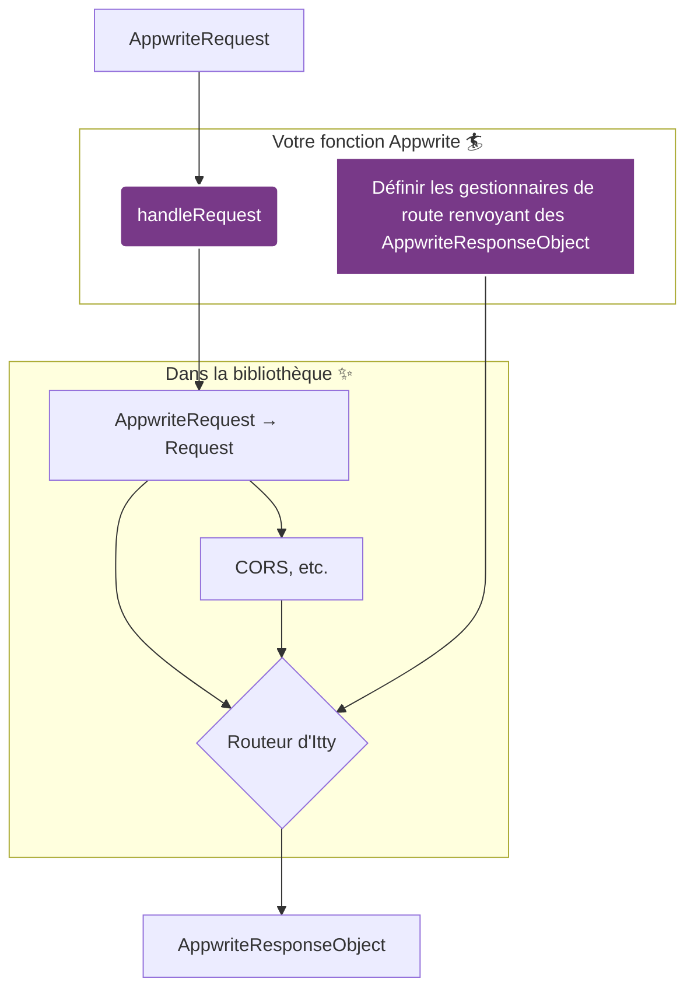

# Premiers pas

La librairie _Appwrite Function Router_ (on dira AFR pour aller plus vite) offre un moyen simple mais puissant de gérer les requêtes HTTP entrantes dans vos fonctions Appwrite, en les acheminant vers des gestionnaires, les fameux _route handlers_, aussi appelés _endpoints_ ou parfois _middlewares_. Essayons d’y voir plus clair :

- Un _route handler_ est une fonction de travail associée à un _endpoint_ ; celui-ci _déclare_ quelle(s) requête(s) l’intéresse, mais il délègue le sale boulot à son _route handler_, qui lui doit construire et retourner une réponse HTTP ;
- Un _middleware_ est un type particulier de _route handler_ qui tout simplement ne retourne rien, mais peut par contre produire des effets de bord (ex. modification de la requête entrante, préparation de la future réponse sortante, logging, connexion à des services tiers pour envoyer/rappatrier des données, etc.), avant de laisser filer la requête entrante vers, soit le prochain middleware s’il y en a un, soit le endpoint final.

On peut créer des chaînes de traitement, en enchaînant les _middlewares_ jusqu’à un _endpoint_ qui sera nécessairement le terminus.

Aussi bien les _route handlers_ que les _middlewares_ peuvent `throw` une erreur pour stopper net le processus de prise en charge de la requête entrante, ce qui renverra automatiquement et immédiatement une réponse d’erreur.

Voilà à quoi ils ressemblent concrètement :

<!-- prettier-ignore-start -->
```typescript
import { handleRequest } from '@kaibun/appwrite-fn-router';

// 0. Ça, c’est ta fonction Appwrite habituelle.
export default async (context) => {

  // 1. AFR nécessite essentiellement d’appeler une seule fonction : handleRequest.
  //    Attention à bien retourner sa valeur de retour, à savoir, la réponse HTTP.
  return handleRequest(

    // 2. On doit lui passer le contexte Appwrite, sinon ça va être compliqué.
    context,

    // 3. Puis comme elle est sympa, elle crée un routeur pour nous et nous
    //    l’expose dans un callback de notre fabrication, où nous pouvons
    //    enregistrer des routes sur le routeur (des couples endpoint/handler) !
    (router) => {
      // router.get('/hello') est un endpoint qui va intercepter et gérer les
      // requêtes HTTP du type GET /hello, en déléguant le traitement à son
      // route handler, c’est-à-dire le callback (ici anonyme, mais on peut le
      // définir ailleurs, l’importer, etc.)
      router.get('/hello', (req, res) => res.text(`Hello ${req.foo}!`));
    },

    // 4. Éventuellement, on peut passer des options (on en reparle juste après).
    {
      log: false,
      errorLog: true,
      ittyOptions: {
        before: [
          // Ce callback est un middleware, de type before, donc exécuté *avant*
          // le route handler du endpoint qui aura matché une requête (et ce pour
          // n’importe quelle requête, les middlewares ne sont a priori pas
          // sélectifs, sauf si leur logique interne le veut — ex. ne réagir que
          // si req.method === "POST", etc.).
          (req, res, log, error) => {
            req.foo = 'bar'; // Cette donnée sera disponible dans le endpoint.
            log('I’m a middleware! I tweaked the request. Have fun, bye.');
          },
        ],
      },
    }
  );
};
```
<!-- prettier-ignore-end -->

## Lien entre AFR et le router itty

En tant que librairie utilitaire, AFR est essentiellement un _wrapper_ plutôt malin autour d’un micro-routeur, [itty-router](https://itty.dev/itty-router/api#router). AFR gère l’instanciation et l’intégration d’un `Router` itty au sein de l’environnement d’exécution des Fonctions Appwrite, qui est un poil non-standard par rapport à ce qui se fait dans l’univers JavaScript/Node, donc pas immédiatement compatible avec les routeurs prévus pour Node. AFR veille à ce que tout le flux de données entrant/sortant se déroule bien, mais gère aussi le typage TypeScript, les options CORS, etc.

Je vous conseille de lire la documentation de itty, car par choix de design, AFR ré-expose en fait quasiment trait pour trait l’API de itty. Ainsi, vous n’avez pas à apprendre deux outils ; d’autant que Itty peut être utilisé ailleurs que dans des fonctions Appwrite !

Par exemple, la méthode `handleRequest` d’AFR accepte de manière transparente toutes les options supportées par itty, telles que `catch`, `before`, `finally`, `routes`, etc. Il suffit de les envoyer dans la propriété `ittyOptions` de l’objet d’options :

```typescript
import { handleRequest } from '@kaibun/appwrite-fn-router';

export default async (context) => {
  return handleRequest(
    context,
    () => {},
    {
      ittyOptions: {
        // Par exemple, itty accepte aussi des déclarations de routes plus
        // « bas niveau », mais c’est moins sympa à utiliser que le callback d’AFR !
        routes: [
          ["GET", /^\/hello$/, [(req, res) => res.text('Hello!')], "/hello");
        ],
        // itty accept aussi, entre autres options, un callback pour gérer les exceptions.
        catch: (err, req, res, log, error) => {
          error('Oops, catched an error:', err);
          return res.json(
            { message: 'Something (whatever) went really wrong.' },
            500
          );
        },
      },
    }
  );
};
```

:::info

**Comment fonction itty-router, en résumé :**

TODO: résumer

:::

## Signature des handlers et middlewares

Une fonction Appwrite reçoit de son environnement d’exécution un objet `context`, qui contient quatre propriétés :

- `req` est une version « à la Appwrite » de l’objet `Request` standard (auquel on n’a malheureusement pas accès)
- `res` est une version « à la Appwrite » de l’objet `Response` standard (idem, pas accès)
- `log` est une fonction pour logger des messages normaux, on les voit dans la console web de Appwrite
- `error` est une fonction pour logger des messages d’erreurs (idem)

:::info

Pour les fans de TypeScript, les types correspondants sont `AppwriteRequest`, `AppwriteResponse`, `DefaultLogger` et `ErrorLogger`.

:::

Ce contexte Appwrite est passé tel quel à AFR, comme premier argument de `handleRequest`, de sorte que AFR puisse comprendre à quelle requête il doit réagir, comment y répondre, etc.

Malheureusement mais fort logiquement, le router itty n’est pas conçu pour travailler avec ces formats spécifiques d’objets Appwrite. D’ailleurs, aucun router Node ne l’est. Heureusement, AFR va s’occuper de tout, en remaniant un peu le contexte.

**Tous les _route handlers_ et _middlewares_ vont recevoir automatiquement un contexte amélioré, le « contexte AFR », sous la forme cette fois d’une liste d’arguments, toujours dans cet ordre :**

1. la requête `AppwriteRequest` mais avec des p’tits trucs en plus pour bien fonctionner avec itty-router
2. la réponse `AppwriteResponse`, telle que reçue par la fonction Appwrite
3. la fonction `log`, idem
4. la fonction `error`, idem
5. un objet, souvent appelé `internals`, qui contient notamment une `Request` native (mais normalement tu n’en auras pas besoin)
6. éventuellement, tout et n’importe quoi que tu voudrais faire circuler dans la chaîne de traitement des requêtes !

#### Exemple de _route handler_ utilisant son contexte AFR :

```typescript
router.get('/widgets', (req, res, log, error) => {
  log(`Handling ${req.method} ${req.path} like a boss.`);
  error('No widgets found, though.');
  return res.json({ items: [] });
});
```

#### Exemple de _middleware_ faisant nawak :

```ts
router.all('*', (req, res, log, error, internals) => {
  log('I’m definitely not returning a response. But...');
  log("'AM GONNA LEAK SOME DATA BRO! RAAAAGGGIIN");
  log(internals.request.headers['authorization']);
});
```

## Flux logique, étape par étape

Le diagramme suivant illustre comment la bibliothèque gère tout ça. Les parties avec lesquelles vous interagissez sont mises en évidence (_Votre fonction Appwrite_).



### 1. Accueillir la requête d'Appwrite avec [`handleRequest(context, withRouter)`](/usage/handleRequest)

C'est le point d'entrée principal. Il prend le `context` d'exécution d'Appwrite et votre callback (appelé en interne `withRouter`).

```typescript
import { handleRequest } from '@kaibun/appwrite-fn-router';

// Ceci est votre gestionnaire de fonction Appwrite typique, avec
// son contexte contenant les objets req, res, log et error.
export default async (context) => {
  return handleRequest(context, (router) => {
    // Vous définirez vos routes ici à l'étape 3
  });
};
```

:::info

En interne : il duplique l’object `req` du contexte, au format `AppwriteRequest`, en un objet `Request` standard, que le routeur itty pourra comprendre et manipuler ensuite.

:::

### 2. Obtenir un nouveau routeur de [`createRouter`](/usage/createRouter)

Cette fonction crée une nouvelle instance de routeur itty. Vous enregistrerez vos routes sur cette instance à l'étape suivante.

:::info

En interne : la création du `Router` est effectuée automatiquement par `handleRequest`, vous n'avez donc pas besoin d’appeler cette fonction vous-même.

:::

### 3. Définir les Routes grâce à `withRouter`

Dans le callback `withRouter` de `handleRequest`, vous définissez vos routes.

Chaque gestionnaire de route recevra le contexte AFR, donc un objet `req`, suivi de `res`, `log`, `error` ; et enfin `internals` (si vous en avez besoin, ce qui ne devrait pas arriver). Si tout roule, il renvoie un objet au format `AppwriteResponseObject`, et `res` a justement des méthodes pour en générer. La signature de vos handlers doit donc typiquement être :

```typescript
handleRequest(context, (router) => {
  router.get('/', (req, res, log, error) => {
    return res.send('Bonjour, le monde !');
  });

  router.post('/users', async (req, res, log, error) => {
    const user = await req.bodyJson;
    // Ex. valider et sauvegarder l'utilisateur...
    // ... et peut-être récupérer un user modifié (avec un ID) ? Le renvoyer !
    return res.json({ success: true, user });
  });
});
```

:::info

En interne : là encore, AFR fait en sorte de transposer le contexte Appwrite en un contexte « AFR » qui lui ressemble comme deux gouttes d’eau, mais est en plus compatible avec le routeur itty.

:::

### 4. Attendre que `runRouter` trouve le bon endpoint

Après avoir défini vos routes, `handleRequest` appelle en interne [`runRouter`](/usage/runRouter).

Lorsqu’une requête HTTP arrive, cette fonction cherche parmis les routes déclarées laquelle correspond ; si il en trouve une, il exécute son _handler_, sinon, une réponse d'erreur 404 est renvoyée. Cela se produit automatiquement, vous n'avez donc rien d’autre à faire que d’attendre des requêtes de la part de vos utilisateurs !

:::info

En interne : c’est la méthode `router.fetch` qui est déclenchée, et elle a besoin de travailler avec une `Request` native. Heureusement, AFR a prévu le coup et à préparé ça dans `internals.request`. Mais là encore, c’est un détail dont vous n’avez pas à vous soucier.

:::

### 5. Laisser filer votre `AppwriteResponseObject`

Comme vous l'avez vu à l'étape 3, un _route handler_ doit renvoyer un `AppwriteResponseObject`, qui est le format de réponse attendu par le runtime Appwrite (en lieu et place d’une `Response` native de Node). On a vu aussi qu’on peut générer un tel objet en utilisant les utilitaires de `res` (`res.json()`, `res.send()`, etc.). Mais on peut tout aussi bien simplement composer un objet respectant la forme suivante :

```ts
type ResponseObject<BodyType = unknown> = {
  body: BodyType;
  statusCode: number;
  headers: Headers;
};
```

AFR garantit qu'un tel objet est correctement renvoyé par la fonction. Finalement, l'environnement d'exécution des Fonctions Appwrite se chargera de le convertir en une `Response` standard pour, _in fine_, envoyer réellement la réponse HTTP sur le réseau.

```typescript
// La partie la plus importante de votre travail : définir des gestionnaires de route
// renvoyant des AppwriteResponseObject bien conçus (c’est facile comme tout !)
//
// Voilà un dernier exemple un peu plus réaliste, qui montre qu’on peut utiliser
// de l’asynchrone.
router.get('/posts/:id', async (req, res, log, error) => {
  const { id } = req.params;
  const post = await db.posts.findById(id);

  if (!post) {
    error(`Post not found: ${id}`);
    reportError({ category: 'post', req: req.toString(), params });
    return res.status(404).send('Article non trouvé');
  }

  return res.json(post);
});
```
