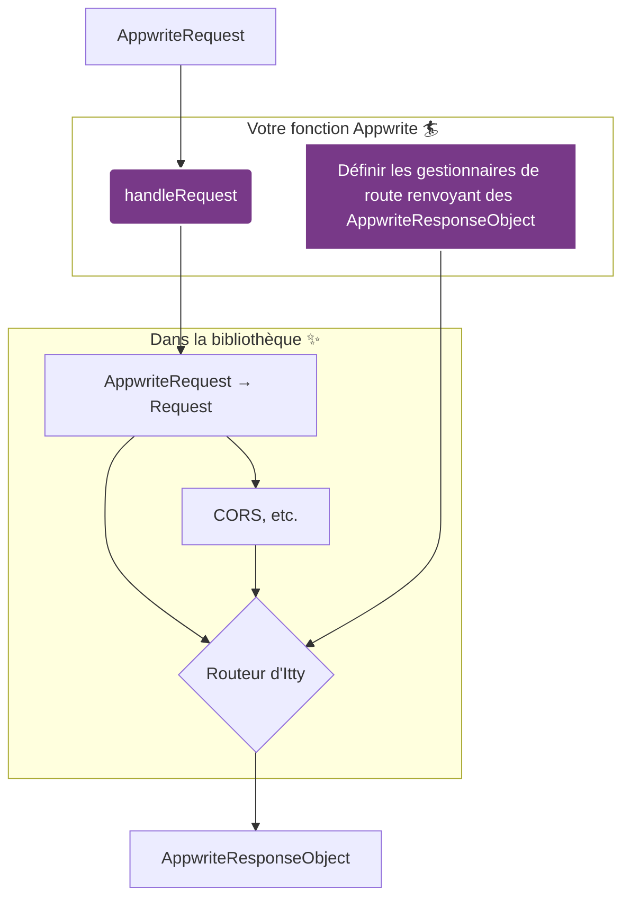

# Comment ça marche

La bibliothèque offre un moyen simple mais puissant de gérer les requêtes dans vos fonctions Appwrite, en les acheminant vers des gestionnaires (_route handlers_, aussi appelés _endpoints_) spécifiques à chaque requête HTTP.

Sa principale valeur ajoutée est d'abstraire les objets `Request` et `Response` natifs du Web que les routeurs utilisent généralement. Cela vous permet, en tant que développeur, de travailler exclusivement avec le `context` fournit par Appwrite, qui a ses propres objets `req` (du type `AppwriteRequest`), `res` (du type `AppwriteResponse`), ainsi qu’avec le type `AppwriteResponseObject` comme format de réponse. Cette conversion automatique vous offre une expérience de développement transparente au sein de l'écosystème Appwrite.

## Flux logique

Le diagramme suivant illustre comment la bibliothèque gère cette transformation. Les parties avec lesquelles vous interagissez sont mises en évidence (_Votre fonction Appwrite_).



### 1. Accueillir la requête d'Appwrite avec [`handleRequest(context, withRouter)`](/usage/handleRequest)

C'est le point d'entrée principal. Il prend le `context` d'exécution d'Appwrite et votre callback `withRouter`.
En interne, il transforme l'objet de requête spécifique d’Appwrite en un objet `Request` standard, que le routeur interne peut comprendre et manipuler.

```typescript
import { handleRequest } from '@kaibun/appwrite-fn-router';

// Ceci est votre gestionnaire de fonction Appwrite typique, avec
// son contexte contenant les objets req, res, log et error.
export default async (context) => {
  return handleRequest(context, (router) => {
    // Vous définirez vos routes ici à l'étape 3
  });
};
```

### 2. Obtenir un nouveau routeur de [`createRouter`](/usage/createRouter)

Cette fonction crée une nouvelle instance de routeur. Vous enregistrerez vos routes sur cette instance à l'étape suivante. _La création du routeur est effectuée en interne par `handleRequest`, vous n'avez donc pas besoin d’appeler cette fonction vous-même._

### 3. Définir les Routes grâce à `withRouter`

Dans le callback `withRouter` de `handleRequest`, vous définissez vos routes.

Le gestionnaire de chaque route reçoit à la fois l'objet `Request` standard et l'objet `req` d'Appwrite, ainsi que le reste du contexte d'Appwrite (`res`, `log` et `error`), afin que vous puissiez continuer à travailler dans un environnement familier.

```typescript
// ... implémentons le rappel withRouter, en enregistrant nos routes :
handleRequest(context, (router) => {
  router.get('/', (vanillaRequest, req, res, log, error) => {
    // req et res sont les abstractions d'Appwrite
    // En utilisant les méthodes de res, le gestionnaire de route doit renvoyer
    // des AppwriteResponseObject qui sont attendus par l'environnement d'exécution
    return res.send('Bonjour, le monde !');
  });

  router.post('/users', async (vanillaRequest, req, res, log, error) => {
    const user = req.body;
    // Faire quelque chose avec l'utilisateur... peut-être attendre un résultat...
    return res.json({ success: true, user });
  });
});
```

### 4. Attendre que `runRouter` trouve le bon endpoint

Après avoir défini vos routes, `handleRequest` appelle en interne [`runRouter`](/usage/runRouter). Cette fonction fait correspondre la `Request` native entrante aux routes définies et exécute le gestionnaire correspondant (s'il y en a un ; sinon, une réponse d'erreur est renvoyée). Cela se produit automatiquement, vous n'avez donc rien à faire.

### 5. Laisser filer votre `AppwriteResponseObject`

Comme vous l'avez vu à l'étape 3, un gestionnaire de route doit renvoyer un `AppwriteResponseObject`, qui est le format de réponse attendu par le runtime Appwrite (plutôt qu’une `Response` native). On peut générer un tel objet en utilisant les méthodes de `res` (`.json()`, `.send()`, etc.), ou simplement composer un objet satisfaisant la forme suivante :

```ts
type ResponseObject<BodyType = unknown> = {
  body: BodyType;
  statusCode: number;
  headers: Headers;
};
```

La bibliothèque garantit qu'un tel objet est correctement renvoyé par la fonction, sans aucune autre transformation nécessaire de votre part. Finalement, l'environnement d'exécution des Fonctions Appwrite se chargera de le convertir en une `Response` standard pour envoyer réellement la réponse HTTP sur le réseau.

```typescript
// La partie la plus importante de votre travail : définir des gestionnaires de route
// renvoyant des AppwriteResponseObject (facile comme tout !)
router.get('/posts/:id', async (vanillaRequest, req, res, log, error) => {
  const { id } = req.params;
  const post = await db.posts.findById(id);

  if (!post) {
    return res.status(404).send('Article non trouvé');
  }

  return res.json(post);
});
```
